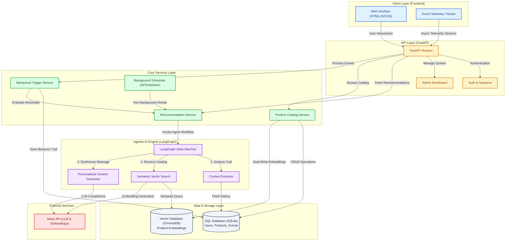

# SmartReco — Behavioural AI Recommendation Agent

A course marketplace that watches how each learner behaves, reasons over that behaviour with
an agentic workflow, retrieves matching courses from a vector database, and writes a
personalised, persuasive recommendation grounded in the real catalog — refreshed as the
learner's interests move, and optionally delivered proactively by email.

Every LLM/AI call goes through **Mesh API**.

---

## What's in here

| Requirement | Where it lives |
|---|---|
| Web platform, email/password auth, user + admin roles | `app/routers/auth.py`, `app/security.py`, `app/deps.py` |
| Relational schema (users, products, events, recommendations) | `app/models.py` |
| Admin product CRUD with **dual-write to SQL + vector DB** | `app/routers/admin.py`, `app/services/product_service.py` |
| Behavioural event tracking (batched, throttled, non-blocking) | `app/static/js/tracker.js`, `app/routers/events.py` |
| Agentic recommendation engine (RAG + reasoning + persuasion) | `app/agent/`, `app/services/recommender.py` |
| Efficient AI-call triggering and caching | `app/services/trigger.py` |
| ⭐ Structured agent framework (LangGraph) | `app/agent/graph.py`, `app/agent/nodes.py` |
| ⭐ Scheduled proactive delivery (APScheduler + email) | `app/services/scheduler.py`, `app/services/mailer.py` |
| ⭐ Observability (LangSmith tracing) | `app/services/tracing.py` |
| ⭐ Retrieval polish (metadata filtering, re-ranking, fusion, diversity) | `app/services/retrieval.py` |

---

## Quick start

```bash
git clone <your-repo-url> && cd smartreco
python -m venv .venv && source .venv/bin/activate      # Windows: .venv\Scripts\activate
pip install -r requirements.txt

cp .env.example .env                                   # then add your MESH_API_KEY (rsk_...)

python -m app.seed --reset --demo                      # catalog + demo accounts + a demo session
uvicorn app.main:app --reload                          # or: python run.py
```

Open <http://localhost:8000>.

**Seeded accounts**

| Role | Email | Password |
|---|---|---|
| Learner | `learner@smartreco.dev` | `learner123` |
| Admin | `admin@smartreco.dev` | `admin123` |

`--demo` pre-seeds a realistic browsing session (someone converging on agentic AI), so the
learner dashboard has a real recommendation the moment you log in. Without it, just browse
the catalog for a minute and the dashboard fills itself.

> **Runs without a Mesh key too.** Missing or unreachable Mesh does not crash anything —
> the agent degrades to deterministic analysis, local embeddings and template copy, and the
> admin System page shows exactly which components are degraded. Add `MESH_API_KEY` to get
> the real thing.

---

## Architecture



### The agent graph

Six nodes, explicit conditional edges, bounded self-correction:

| Node | What it does |
|---|---|
| `analyze` | Turns the behaviour profile into a retrieval brief: inferred intent, an interest headline, 2–4 complementary semantic queries, and an optional level filter. |
| `decide` | Gates retrieval — no usable queries means no wasted vector round trip. |
| `retrieve` | Multi-query semantic search over Chroma with metadata filtering, score fusion, behavioural re-ranking and category diversification. |
| `grade` | Scores retrieval quality (top score + number of strong matches). Deterministic — grading does not need a model. |
| `refine` | On weak retrieval, rewrites the queries and loops back into `retrieve`. Bounded by `REC_MAX_REFINE_LOOPS`. |
| `generate` | Writes the headline, the persuasive narrative and a per-course reason — **only** from the candidate list. |

If `langgraph` is unavailable the identical nodes and edge logic run through a small
sequential executor (`_run_sequential`), so behaviour never silently changes.

### Grounding

The generator receives a candidate list built from the vector store and re-hydrated from SQL.
Any `product_id` the model returns that isn't in that list is **dropped** (`_bind_items` in
`app/agent/nodes.py`). A hallucinated course cannot reach the user — verified in the smoke
test.

---

## Behavioural tracking

`app/static/js/tracker.js` — the constraint is that tracking must never be felt.

- **Batched.** Events go into an in-memory queue and flush on a 5s timer, at 25 events, on
  tab hide, and on unload. One request carries many events; the server does one bulk insert.
- **Throttled / debounced.** Scroll is throttled to 1/s and only emits at 25% depth
  milestones. Search input is debounced at 700ms, so we record intent, not keystrokes.
- **Off the critical path.** Flushes are wrapped in `requestIdleCallback`; scroll listeners
  are `{ passive: true }`; the ingest endpoint returns `202` before any recommendation work.
- **Survives navigation.** `navigator.sendBeacon` on `pagehide`/`beforeunload`, `keepalive`
  on the fetch path.
- **Fails silently.** A failed flush requeues once. The queue is capped at 200 events and
  drops oldest-first — tracking can never grow unbounded or surface an error.

Signals captured: `page_view`, `product_view`, `search`, `click`, `dwell`, `scroll_depth`,
`add_to_cart`. Dwell only accrues while the tab is visible and the user is active — idle
time over 60s is not counted as attention.

---

## Efficiency: when the agent is allowed to run

An LLM call per user action would be both slow and expensive. Every recommendation request
passes through `app/services/trigger.py` first:

| Condition | Outcome |
|---|---|
| No recommendation yet + any activity | **run** (cold start) |
| Explicit refresh (user button, admin, scheduler) | **run** |
| Last run < `REC_MIN_SECONDS_BETWEEN_RUNS` ago | skip (rate limit) |
| Interest **signature** changed | **run** (behaviour genuinely shifted) |
| ≥ `REC_MIN_NEW_EVENTS` new *significant* events | **run** |
| Cached recommendation older than TTL **and** new activity exists | **run** (staleness) |
| Otherwise | skip — serve the cached recommendation |

The interest signature is a hash of *what the user is into* (top categories, terms, viewed
products, searches) rather than of every event — so 40 more page views on the same topic
produce no new LLM call, while one search in a new direction does.

`page_view` and `scroll_depth` are tracked but don't count toward the trigger threshold;
only searches, product views, clicks, dwell and cart adds do. Run/skip counts are visible on
the learner dashboard and per user in `agent_state`.

---

## Dual-write: SQL + vector database

SQL is the source of truth; the vector store is a derived mirror. All mutations go through
`app/services/product_service.py`:

- **Create** → SQL insert (gets the id) → embed → Chroma upsert.
- **Update** → row marked `vector_synced = False` → SQL update → re-embed → upsert.
- **Unpublish** → vector document **deleted** (unpublished courses must not be retrievable).
- **Delete** → vector document deleted *first*, then the SQL row — an orphaned vector that
  surfaces a nonexistent course is worse than a briefly missing one.

Every product carries `vector_synced`, `vector_version` and `vector_error`, so drift is
visible in the admin UI rather than silent. `reconcile()` repairs drift in both directions
(re-syncs stale rows, removes orphaned vectors); it runs hourly on the scheduler and on
demand from **Admin → Products → Reconcile stores**.

Embeddings go through Mesh. If Mesh embeddings are unavailable, the system falls back to a
deterministic local hashing vectorizer (feature-hashed unigrams + bigrams, L2-normalised) so
the catalog stays searchable — flagged as degraded on the admin System page, never silent.

---

## Bonus features

**⭐ LangGraph** — `app/agent/graph.py`. A real `StateGraph` with conditional edges and a
bounded refine loop, not a linear chain.

**⭐ Scheduled proactive delivery** — `app/services/scheduler.py`. APScheduler
`BackgroundScheduler` started in the FastAPI lifespan:
- `daily_digest` (default 16:00): for every opted-in user with ≥3 events in the last 24h,
  refresh their recommendation, generate email copy through Mesh, and send it.
- `vector_reconcile` (hourly): SQL ↔ vector drift repair.

Without SMTP configured, rendered emails are written to `data/outbox/*.html` so the feature
is fully demoable. Trigger it manually at **Admin → System → Run daily digest now**.

**⭐ Observability** — `app/services/tracing.py`. Set `LANGCHAIN_TRACING_V2=true` and
`LANGCHAIN_API_KEY` and each agent run is traced to LangSmith with the trigger reason, user
and event count as metadata. Independently, every run stores its own node-by-node trace,
exposed at `GET /api/recommendations?refresh=true` and summarised on the dashboard.

**⭐ Retrieval polish** — `app/services/retrieval.py`:
- Multi-query fusion with a consensus bonus for products that surface across queries.
- Metadata filtering (`is_published`, level, price) at the vector-store layer, with pool
  top-up so a filter shapes ranking without starving the candidate set.
- Behavioural re-ranking: `0.55·semantic + 0.18·category fit + 0.12·tag overlap + 0.08·level fit + 0.07·rating`.
- Category diversification that loosens automatically when one interest clearly dominates.
- Deterministic retrieval grading to decide whether to refine.

---

## API

| Method | Path | Purpose |
|---|---|---|
| `POST` | `/api/events/batch` | Batched event ingestion (also accepts `sendBeacon` payloads) |
| `GET` | `/api/events/mine` | Your recent tracked events |
| `GET` | `/api/recommendations` | Current recommendation (`?refresh=true` forces the agent) |
| `POST` | `/api/recommendations/refresh` | Force a run |
| `GET` | `/api/recommendations/profile` | The behavioural profile + live trigger decision |
| `GET` | `/api/recommendations/history` | Previous recommendations |
| `GET` | `/api/health` | Vector backend, agent engine, scheduler, tracing status |

Pages: `/`, `/catalog`, `/product/{slug}`, `/dashboard`, `/login`, `/register`,
`/admin/products`, `/admin/system`.

---

## Configuration

All settings live in `.env` (see `.env.example`). The ones that matter most:

| Variable | Default | Meaning |
|---|---|---|
| `MESH_API_KEY` | — | **Required** for real AI output. All LLM calls route through Mesh. |
| `MESH_CHAT_MODEL` | `openai/gpt-4o-mini` | Cheap model for analysis/refinement |
| `MESH_REASONING_MODEL` | `openai/gpt-4o` | Stronger model for the persuasive generation |
| `REC_MIN_NEW_EVENTS` | `5` | Significant new events needed to re-run the agent |
| `REC_CACHE_TTL_SECONDS` | `1800` | Recommendation staleness window |
| `REC_MIN_SECONDS_BETWEEN_RUNS` | `120` | Hard rate limit per user |
| `REC_MAX_REFINE_LOOPS` | `2` | Bound on the agent's self-correction loop |
| `ENABLE_SCHEDULER` | `true` | Background jobs on/off |
| `DIGEST_HOUR` / `DIGEST_MINUTE` | `16:00` | When the daily digest runs |
| `LANGCHAIN_TRACING_V2` | `false` | LangSmith tracing |

Two models are used deliberately: analysis and query refinement are routine work for a cheap
model, while the persuasive copy — the part the learner actually reads — gets the stronger one.

---

## Verifying it works

```bash
python tests/smoke_test.py
```

Covers, without needing a Mesh key: dual-write create/update/unpublish/delete sync, batched
event ingestion, profile building and signature stability, the trigger policy's run/skip
decisions, a full agent run through LangGraph, and the grounding guarantee that hallucinated
product ids are dropped.

Manual walkthrough:
1. Sign in as the learner, search for something and open two or three courses.
2. Go to **For you** — the recommendation reflects what you just did, and the sidebar shows
   why the agent ran (or why it served cache).
3. Reload — it serves from cache. The skip is the feature.
4. Sign in as admin → **Products**: create a course and watch the vector store count rise;
   delete it and watch it fall. **System** shows live component status.
5. **System → Run daily digest now** → check `data/outbox/` for the rendered email.

---

## Stack

FastAPI · Jinja2 · vanilla JS · SQLAlchemy 2.0 + SQLite (Postgres-ready via `DATABASE_URL`) ·
ChromaDB · LangGraph · APScheduler · LangSmith · **Mesh API** (OpenAI-compatible) for every
model call.

## Notes on resilience

Each external dependency has a defined degradation path, because a recommendation surface
that 500s is worse than one that is slightly less clever:

| Dependency | If unavailable |
|---|---|
| Mesh chat | Deterministic analysis + template copy; flagged `is_fallback` |
| Mesh embeddings | Local hashing vectorizer; flagged on the admin System page |
| ChromaDB | JSON-backed brute-force cosine store with the same interface |
| LangGraph | Sequential executor running the identical nodes and edges |
| SMTP | Emails rendered to `data/outbox/` |
| LangSmith | Tracing no-ops; local per-run traces still recorded |

## Security

`.env` is gitignored and never committed. Passwords are bcrypt-hashed; sessions are signed,
HTTP-only, `SameSite=Lax` cookies. Admin routes are role-guarded. Event payloads are
validated, clamped and size-limited before insert.
